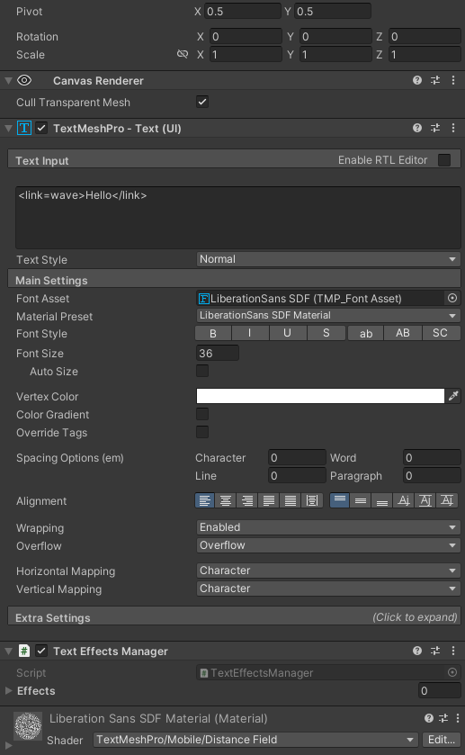
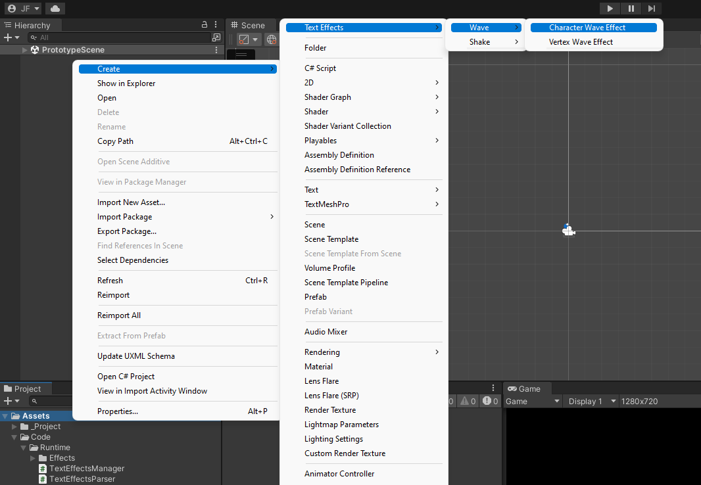
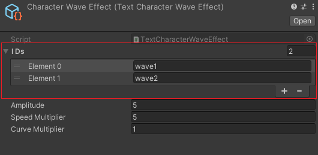
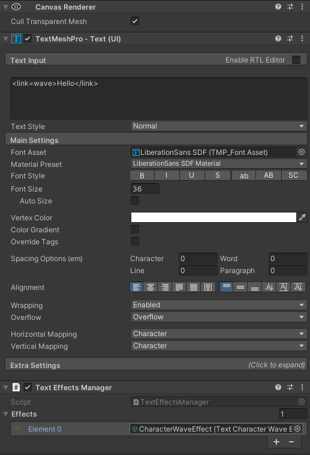
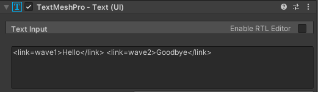

# TMPro Effects
A small collection of code containing different text effects for text mesh pro.

# How to Use

Create a TextMeshPro component and add the TextEffectsManager script to it.

Then create your desired text effect by navigating to Create>TextEffects.

Add the IDs that correspond with this text effect in the IDs list, and fill out the rest of the parameters.

Now add the effect to the TextEffectsManagers Effect list.

Encapsulate your text with a link that has the same ID as one of the IDs in the text effects ID list.

Enter Play Mode to see your results!

